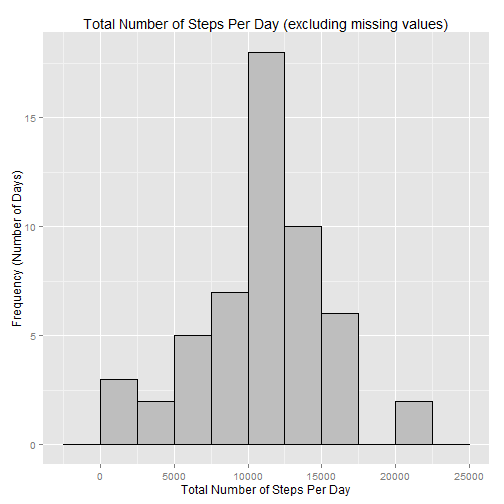
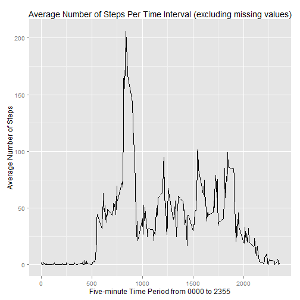
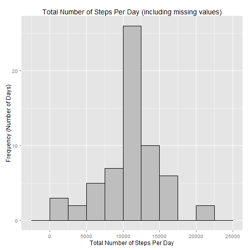
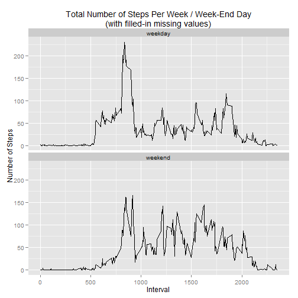

### Assignment

This assignment will be described in multiple parts. You will need to write a report that answers the questions detailed below. Ultimately, you will need to complete the entire assignment in a single R markdown document that can be processed by knitr and be transformed into an HTML file.
Throughout your report make sure you always include the code that you used to generate the output you present. When writing code chunks in the R markdown document, always use echo = TRUE so that someone else will be able to read the code. This assignment will be evaluated via peer assessment so it is essential that your peer evaluators be able to review the code for your analysis. For the plotting aspects of this assignment, feel free to use any plotting system in R (i.e., base, lattice, ggplot2).

Fork/clone the GitHub repository created for this assignment. You will submit this assignment by pushing your completed files into your forked repository on GitHub. The assignment submission will consist of the URL to your GitHub repository and the SHA-1 commit ID for your repository state.

NOTE: The GitHub repository also contains the dataset for the assignment so you do not have to download the data separately.


### Loading and preprocessing the data 

Show any code that is needed to

1. Load the data (i.e. `read.csv()`)
2. Process/transform the data (if necessary) into a format suitable for your analysis.  


```r
setwd("~/Coursera/Reproducible Research/RepData_PeerAssessment1/")
dfn <- "activity.csv"
if (!file.exists(dfn)) {
  unzip(dfn)
}
dta <- read.csv(dfn)
## dta$date <- strptime(dta$date, "%Y-%m-%d %H:%M:%S")  ## Convert date to POSIXlt object 
## We will not run this code because we will cast the date factor as a Date object when  needed.
```

### What is mean total number of steps taken per day? 

For this part of the assignment, you can ignore the missing values in the dataset.

```r
dta.complete <- na.omit(dta)
```

1. Make a histogram of the total number of steps taken each day

+ Load the ggplot2 Library

```r
library(ggplot2)
```

```
## Warning: package 'ggplot2' was built under R version 3.1.2
```

+ Make the histogram

```r
steps.day <- aggregate(steps ~ date, data=dta.complete, FUN=sum)
ggplot(steps.day, 
       aes(x=steps)) + 
       geom_histogram(binwidth=2500, colour="black", fill="gray") + 
       labs(x = "Total Number of Steps Per Day", 
            y = "Frequency (Number of Days)",
            title = "Total Number of Steps Per Day (excluding missing values)")
```

 

2. Calculate and report the mean and median total number of steps taken per day


```r
mean(steps.day$steps)
```

[1] 10766.19

```r
median(steps.day$steps)
```

[1] 10765

### What is the average daily activity pattern?

1. Make a time series plot (i.e. type = "l") of the 5-minute interval (x-axis) and the average number of steps taken, averaged across all days (y-axis)**

+ Create a data frame with the mean number of steps per interval


```r
steps.interval <- aggregate(steps ~ interval, data=dta.complete, FUN=mean)
```

+ Do the time series plot


```r
ggplot(steps.interval, 
       aes(x=interval, y=steps)) + 
       geom_line(stat="identity") + 
       labs(x = "Five-minute Time Period from 0000 to 2355", 
            y = "Average Number of Steps",
            title = "Average Number of Steps Per Time Interval (excluding missing values)")
```

 

2. Which 5-minute interval, on average across all the days in the dataset, contains the maximum number of steps?

+ We need to return the interval from 0000 to 2355 where the maximum number of steps were taken.  So we need to map the interval with the maximum number of steps and seen at which interval it occurs.  The interval of interest is mapped to the column `steps.interval$interval`.  The row is where the maximum value of steps occurs: `which.max(steps.interval$steps)`


```r
steps.interval$interval[which.max(steps.interval$steps)]
```

[1] 835

### Inputing missing values

Note that there are a number of days/intervals where there are missing values (coded as NA). The presence of missing days may introduce bias into some calculations or summaries of the data.

1. Calculate and report the total number of missing values in the dataset (i.e. the total number of rows with NAs)


```r
nrow(dta[!complete.cases(dta$steps),])
```

[1] 2304


2. Devise a strategy for filling in all of the missing values in the dataset. The strategy does not need to be sophisticated. For example, you could use the mean/median for that day, or the mean for that 5-minute interval, etc.

+ Create a data frame **dta.filled** to save the data with the missing values filled. 
+ This will be a copy of the original data frame **dta** that has missing values.
We will first declare a function that with the code to generate the data frame with the replaced
Values.


```r
## Function to generate a data frame where the NA values have been
# replaced by the mean of the values for that interval

fill.data <- function() {
  dta.filled <- dta  # Create a data frame dta.filled to save the data with the missing values filled.
  for (i in (1:nrow(dta.filled)))
    if (is.na(dta.filled[i,"steps"])) {   # Check the value for steps is missing
      t1 <- dta.filled[i,"interval"]      # the value of that interval in t1.  Should be between 0 and 2355
      # Use the index t2 to map into the correct row of the steps.interval data frame that 
      # has the value of the means for each interval.
      t2 <- steps.interval[(steps.interval$interval==t1),"steps"]  
      dta.filled[i,"steps"] <- t2         # Fill the missing data.
      # print(paste(i, dta.filled[i,"steps"]))  # Debug code
    }
  dta.filled  # Return object
  }
```
+ Then we will call the function and save the results in the data frame called **data.filled**
+ The missing values will be filled with the average of steps for that time interval.  
+ This data is in the data frame **steps.interval**

3. Create a new dataset that is equal to the original dataset but with the missing data filled in.


```r
dta.filled <- fill.data()
```

4. Make a histogram of the total number of steps taken each day and Calculate and report the mean and median total number of steps taken per day. 


```r
steps.day.filled <- aggregate(steps ~ date, data=dta.filled, FUN=sum)
ggplot(steps.day.filled, 
       aes(x=steps)) + 
       geom_histogram(binwidth=2500, colour="black", fill="gray") + 
       labs(x = "Total Number of Steps Per Day", 
            y = "Frequency (Number of Days)",
            title = "Total Number of Steps Per Day (including missing values)")
```

 

Mean and median of the filled data set

Calculate the number of steps by day in the filled data set

```r
steps.day.filled <- aggregate(steps ~ date, data=dta.filled, FUN=sum)
```
Calculate the mean and the median of the filled data set

```r
mean(steps.day.filled$steps)
```

[1] 10766.19

```r
median(steps.day.filled$steps)
```

[1] 10766.19

**Do these values differ from the estimates from the first part of the assignment? What is the impact of imputing missing data on the estimates of the total daily number of steps?**

> Replacing missing values with the average value for the time period did not change the mean and slightly increased the median.

### Are there differences in activity patterns between weekdays and weekends?

For this part the weekdays() function may be of some help here. Use the dataset with the filled-in missing values for this part.

1. Create a new factor variable in the dataset with two levels -- "weekday" and "weekend" indicating whether a given date is a weekday or weekend day.

+ First add a new variable 'day' to the data set with complete data (dta.filled)


```r
dta.filled$day[weekdays(as.Date(dta.filled$date)) %in% c("Saturday", "Sunday")] <- "weekend"
dta.filled$day[!weekdays(as.Date(dta.filled$date)) %in% c("Saturday", "Sunday")] <- "weekday"
dta.filled[,"day"] <- as.factor(dta.filled[,"day"]) # Convert the new variable to a factor
```

2. Make a panel plot containing a time series plot (i.e. type = "l") of the 5-minute interval (x-axis) and the average number of steps taken, averaged across all weekday days or weekend days (y-axis). The plot should look something like the following, which was created using simulated data:


```r
steps.days <- aggregate(steps ~ interval + day, data=dta.filled, FUN=mean)
ggplot(steps.days, 
       aes(x=interval, y=steps, group=1)) + 
       geom_line() +
       facet_wrap(~ day, ncol=1) +
       labs(x = "Interval", 
            y = "Number of Steps",
            title = "Total Number of Steps Per Week / Week-End Day\n(with filled-in missing values)")
```

 

Sample panel plot removed

Your plot will look different from the one above because you will be using the activity monitor data. Note that the above plot was made using the lattice system but you can make the same version of the plot using any plotting system you choose.


### Submitting the Assignment

To submit the assignment:

Commit your completed PA1_template.Rmd file to the master branch of your git repository (you should already be on the master branch unless you created new ones)

Commit your PA1_template.md and PA1_template.html files produced by processing your R markdown file with the knit2html() function in R (from the knitr package)

If your document has figures included (it should) then they should have been placed in the figure/ directory by default (unless you overrode the default). Add and commit the figure/ directory to your git repository.

Push your master branch to GitHub.

Submit the URL to your GitHub repository for this assignment on the course web site.

In addition to submitting the URL for your GitHub repository, you will need to submit the 40 character SHA-1 hash (as string of numbers from 0-9 and letters from a-f) that identifies the repository commit that contains the version of the files you want to submit. You can do this in GitHub by doing the following:

Go into your GitHub repository web page for this assignment

Click on the "?? commits" link where ?? is the number of commits you have in the repository. For example, if you made a total of 10 commits to this repository, the link should say "10 commits".

You will see a list of commits that you have made to this repository. The most recent commit is at the very top. If this represents the version of the files you want to submit, then just click the "copy to clipboard" button on the right hand side that should appear when you hover over the SHA-1 hash. Paste this SHA-1 hash into the course web site when you submit your assignment. If you don't want to use the most recent commit, then go down and find the commit you want and copy the SHA-1 hash.

A valid submission will look something like (this is just an example!)

https://github.com/rdpeng/RepData_PeerAssessment1

7c376cc5447f11537f8740af8e07d6facc3d9645
